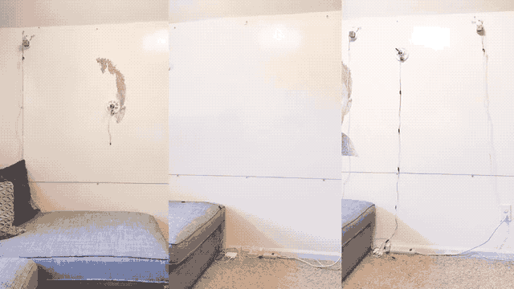
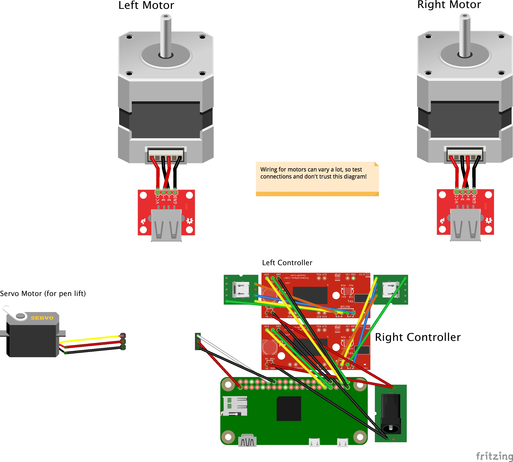

# Drawbot ✏️🤖

Drawing robot capable of rendering SVG paths over WebSockets. Powered by a Raspberry Pi running Node.js.

## Parts List
### Printable Parts
* [Motor Mounts](https://www.thingiverse.com/thing:3054707) (two of each)
* [Electronics Case](https://www.thingiverse.com/thing:3058312)
* [Pen Holder Gondola](https://www.thingiverse.com/thing:372244)
* [Servo Horn Extension](https://www.thingiverse.com/thing:2427037)

### Everything Else (~$150 or less)

* [NEMA 17 Stepper Motors, 36.8oz.in 12v 0.4a](https://www.amazon.com/Stepping-Motor-26Ncm-36-8oz-Printer/dp/B00PNEQ9T4) (need 2) - $23.98
* [Suction Cup with Quick Release](https://www.harborfreight.com/suction-cup-with-quick-release-62715.html) (x2) - $5.98
* [Spiderwire 80-pound fishing line](https://www.amazon.com/gp/product/B00LDYLVVO/ref=oh_aui_search_detailpage?ie=UTF8&psc=1) - $17.56
* [Micro USB cable 10-ft. 2-pack](https://www.amazon.com/Android-Extremely-Durable-Charging-Generation/dp/B01NAG0YPD/ref=sr_1_8) - $8.99
* [Micro USB breakout 10-pcs](https://www.amazon.com/MagiDeal-10pcs-Female-Pinboard-2-54mm/dp/B0183KF7TM/ref=sr_1_4) (only need 2) - $6.59
* [USB type a female breakout 2-pack](https://www.ebay.com/itm/USB-2-0-Type-A-Female-Breakout-Board-2-54mm-Header-Gold-plated-Pack-of-2/302540094106) - $4.50
* [Raspberry Pi Zero W](http://www.microcenter.com/product/486575/Zero_W) - $10)
* [Easydriver Stepper Motor Driver](https://www.amazon.com/Cylewet-Easydriver-Stepper-Headers-Screwdriver/dp/B073D4H4F4/ref=sr_1_cc_1) (2-pack) - $9.99
* [SG92R](http://www.microcenter.com/product/454408/Micro_Servo) Micro Servo motor - $6.99
* [6003zz bearing 17x35x10](https://www.amazon.com/VXB-6003ZZ-Bearing-17x35x10-Shielded/dp/B002BBCO32/ref=sr_1_1) (need 2) - $11
* [10pcs 500mm 3-pin servo extensions](https://www.amazon.com/White-Terminal-Female-Extension-Airplane/dp/B01HLUZO4S/) (need several) - $7.69
* [2.1mm x 5.5mm barrel jack 15pcs](https://www.amazon.com/15PCS-Power-Socket-Barrel-Type-DC-005/dp/B00W944ACE/ref=sr_1_5) (need 1) - $7.59
* [12v 1a power adapter 2.1mm/5.5mm lead](https://www.amazon.com/Dericam-Power-Adapter-Supply-1000mA/dp/B01N3SNRE4/ref=sr_1_3) - $9.99
* [USB Micro Power Adapter](https://www.amazon.com/Keyestudio-Raspberry-Supply-Adapter-Charger/dp/B073RBXX2G/ref=sr_1_20) - $5.99
* [Pololu Universal Mounting Hub for 5mm shaft, #4-40 holes (2-pack)](https://www.pololu.com/product/1203) - $11.44
* [USB fan (40mm)](https://www.amazon.com/gp/product/B071JB9WYB/) - $7.99
* \#8-32 x 1-5/8 in. Eye Bolts (2-pack) - $0.98
* 8 screws for spools (#4-40 x ~½")
* 8 screws for motors (M3-.50 x 6mm metric machine screws)
* 1-2 small screws for gondola to secure pen/marker
* [Mounting Putty](https://www.amazon.com/Loctite-Fun-Tak-Mounting-2-Ounce-1087306/dp/B001F57ZPW) - $4.87
* Standard wire or jumper wires (and headers for components if using jumpers)
* Dry erase markers (or other drawing implements)
* Micro SD card (class 10 or better)

## Wiring



## Hardware Assembly

Thank you to the kind people at the Johnson County Library's Black & Veatch [MakerSpace](https://www.jocolibrary.org/makerspace) for documenting the assembly process at [instructables.com](https://www.instructables.com/id/Drawbot/).

## Raspberry Pi Zero W Basic Setup
1. **Download and install [Etcher](https://etcher.io/)**.
2. **Download and install latest [Raspbian OS](https://www.raspberrypi.org/downloads/raspbian/)** and flash it onto your SD card with Etcher.
3. **Enable SSH** by adding a blank file named `ssh` (no extension) to the `boot` directory on the Pi's SD card. (Last tested with Raspbian Stretch Lite 2018-06-27 version.)
4. **Set up Wifi** by adding a file named `wpa_supplicant.conf` to the same `boot` directory with the following contents (replace `MySSID` and `MyPassword` with your credentials):  
	```
	ctrl_interface=DIR=/var/run/wpa_supplicant GROUP=netdev
	update_config=1
		
	network={ 
		ssid="MySSID" 
		psk="MyPassword" 
	}
	```

## Software Prerequisites
From a device connected to the same network as the Drawbot Pi, SSH into the Pi with `ssh pi@raspberrypi.local`. The default password is `raspberry`.

Then, on the Drawbot Pi:

1. **Update, upgrade, and install NPM, Git.** (Automatically answer "yes" to everything.):
	* `sudo apt-get update`
	* `sudo apt-get upgrade`
	* `sudo apt-get install npm`
	* `sudo apt-get install git`

2. **Install Node.js.**
	* `sudo npm install -g n` (Install **n** for node.js version management. [github.com/tj/n](https://github.com/tj/n))
	* `sudo n stable` (Install latest stable version of Node.js. Last tested with v10.8.0)

3. **Upgrade NPM.** (and remove old apt-get version).
	* `sudo npm install npm@latest -g`
	* `sudo apt-get remove npm`
	* `sudo reboot` (After rebooting, you'll have to SSH into the Pi again.)

4. **Install pigpio C library.** [npmjs.com/package/pigpio](https://www.npmjs.com/package/pigpio)
	* `sudo apt-get install pigpio` (Only if you're using Raspbian *Lite*.)
	* `npm install pigpio`

## Installation
On the Drawbot Pi:

1. `git clone https://github.com/andywise/drawbot.git` to clone this repository.
2. `cd drawbot`
3. `npm i`

## Use
On the Drawbot Pi:

* Run `npm start` or `sudo node draw.js` to start the Drawbot controller.

## Controlling the Drawbot
On a device connected to the same local network as the Drawbot Pi:

* Go to [raspberrypi.local/control](http://raspberrypi.local/control) to access the Drawbot control interface.
* Use the "bullseye" interface to manually position the gondola, or raise/lower the pen/marker.
* Use the settings panel to configure the Drawbot's `D`, `X`, and `Y` values (see "Configuration" below).
* Drag and drop an SVG file onto the control interface to send artwork to the Drawbot!

### SVG Artwork Notes:
* **Only the first `<path>` element will be drawn**, so if necessary, combine artwork into a single compound path.
* The Drawbot will scale artwork so that **1 pixel = 1 millimeter**.

## Configuration
* **Enter value for `D`:** measure distance between string starting points (in millimeters).
* **Enter starting `X` and `Y` values:** measure distance from left and top (respectively) of left string starting point to initial pen position (also in mm).
* Note: Values will be stored in the `config.json` file.

## Rendering Raster Artwork (Coming Soon!)
* For now, go check out ["TSP Art."](https://wiki.evilmadscientist.com/TSP_art)
